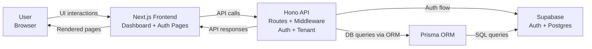

# System Architecture Diagram (High-Level Overview)

## Notes

- `User (browser)` interacts with the Next.js application.
- `Next.js Frontend` sends authenticated API requests to Hono.
- `Hono API` enforces middleware (`auth` and `tenant`) before route handlers.
- `Supabase` handles authentication and hosts PostgreSQL.
- `Prisma ORM` is used by the API for database access
